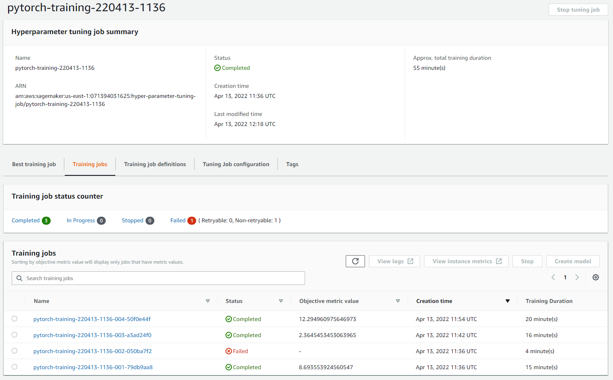

# Image Classification using AWS SageMaker
Use AWS Sagemaker to train a pretrained model that can perform image classification by using the Sagemaker profiling, debugger, hyperparameter tuning and other good ML engineering practices.

Selected dataset: dog breed classication avaiable [here](https://s3-us-west-1.amazonaws.com/udacity-aind/dog-project/dogImages.zip)

Main project file is Notebook: [`train_and_deploy.ipynb`](train_and_deploy.ipynb), which contains an example successful output for each command.

## Project Set Up and Installation
Enter AWS through the gateway in the course and open SageMaker Studio. 
Download the starter files.
Download/Make the dataset available. 
The course AWS account will probably not work for you due to access issues to computation machines used in this project. It is recommended to use your personal account for that. AWS costs of this training should be less than 5 USD and will take around a day to complete (tuning and training).

## Dataset
The provided dataset is the dogbreed classification dataset which can be found [here](https://s3-us-west-1.amazonaws.com/udacity-aind/dog-project/dogImages.zip).

Some dataset characteristics:
There are 133 total dog categories.
There are 8364 total dog images.

There are 6681 training dog images.
There are 835 validation dog images.
There are 848 test dog images.

Sample dataset images:

### Access
Upload the data to an S3 bucket through the AWS Gateway so that SageMaker has access to the data.

## Hyperparameter Tuning
For the project I choose pretrained resnet50 model, because it is suited for image classification tasks.
Hyperparameter tuning was performed using sctipt [`hpo.py`](hpo.py). 
To speed up hyperparameters tuning the tuning is performed on only 10% of the dataset images.

Two hyperparameters were selected for tuning:
- learning rate - to observe when the model learns fasters without overfitting
- batch-size - to find an optimal value for the batch to optimize learning process time

Hyperparameter tuning ranges:
- Learning rate was tuned for range: `0.001, 0.1` - found optimal value is `0.0014738112822062317`..
- Batch size was tuned for values: ``{32, 64, 128, 256, 512}`` - found optimal value is `32`.

Results of hyperparameter training jobs:

Metric values was `12.29`, `8.69`, and `2.36`. One job failed due to some connection issues in AWS (model download crashed). 
This step is costly and take a lot of time so I don't want to replicate results if accepted number of training jobs is 2.

## Debugging and Profiling
In order to debug the final model I have prepared additional script: [`train_model.py`](train_model.py).

The model uses the best hyperparameters detected in previous step:
- learning rate = `0.0014738112822062317`
- batch size = `32`

In the Jupiter notebook multiple rules for debugger and profiller were created. Also the training now uses 20% of the dataset images. Ideally this training should use 100% of the dataset, but then the job would take eternity to finish. Also training shoul be ran on GPU machine (image classification is much faster on GPU), but these machines are costly on personal account, and the build-in Udacity account does not have access to use them.

### Results
Profiler results are located in HTML file [here](ProfilerReport/profiler-output/profiler-report.html).

Learning parameters decreased over time as presented in figure below:

## Model Deployment
In order to deploy we need to create additional entrypoint for the network to load and preprocess image. 
These operations are included in `inference.py` file (not in `train_model.py`!).
Example of preprocessing procedure is presented in Notebook [`train_and_deploy.ipynb`](train_and_deploy.ipynb). 
The trained model return correct results for the test image.

A screenshot of the deployed active endpoint in Sagemaker.

## Standout Suggestions
I tried to train the network on GPU machines and the training procedure was a bit faster, but AWS charged me for these machines so I had to stop experimenting on them. 

The biggest problem with this project was for me to convert the dataset into understandable format for AWS structures. 
For reproducing ouside AWS one can used `sklearn.datasets` to download the same dog breed dataset. Also [Stanford Dogs](https://www.tensorflow.org/datasets/catalog/stanford_dogs) dataset is very similar and it is built-in in tensorflow which can be useful for further development.